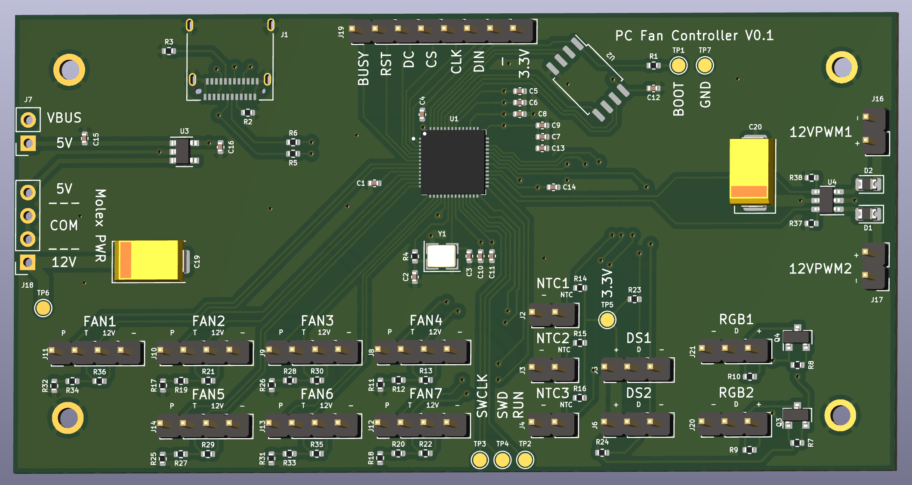

# PCFanController

A completly ~~overkill~~ sound and smart fan controller able to :
- Read 3 NTC 10K sensor (temperature sensor)
- 2x separated buses for DS18B20 (more temperature sensor)
- 2x separated WS2812 buses (RGB led)
- E-Ink display support
- 7x PWM fan support with tachymeter reading
- 2x 12 volt PWM output (Up to 20A per port)